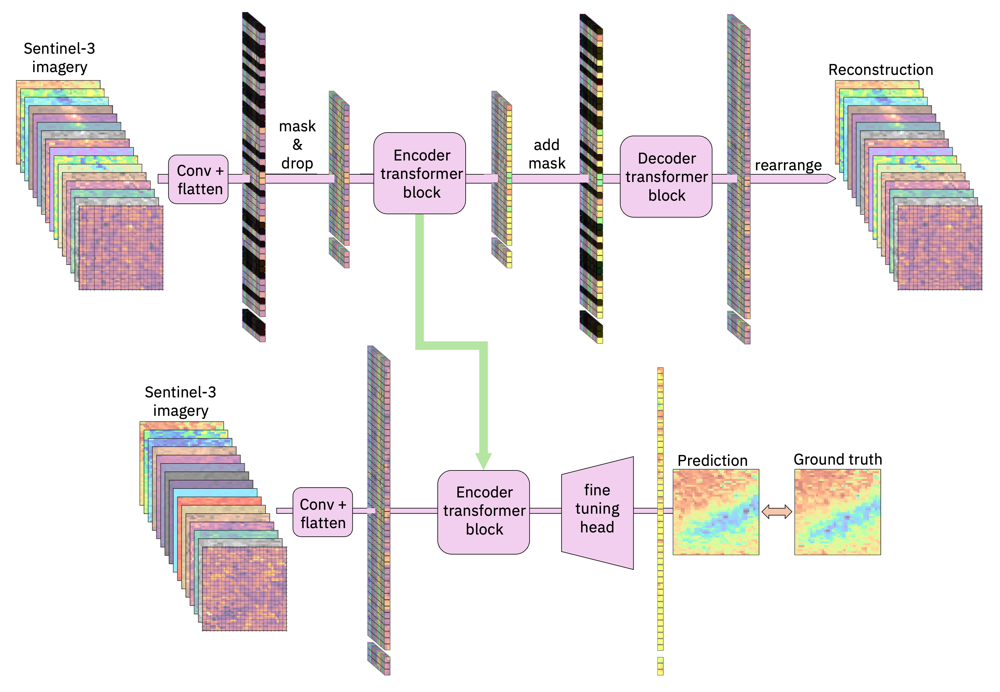

# granite-geospatial-ocean

The granite-geospatial-ocean foundation model was jointly developed by IBM and STFC as part of a collaboration with the University of Exeter and Plymouth Marine Lab under the UK HNCDI programme. This pre-trained model supports a range of potential use cases in ocean ecosystem health, fisheries management, pollution and other ocean processes that can be monitored using ocean colour observations. We provide an example to fine tune the model to quantify primary production by phytoplankton (carbon sequestration which determine's the ocean's role in climate change). 


## Architecture Overview

The granite-geospatial-ocean model is a transformer-based geospatial foundation model trained on Sentinel-3 Ocean Land Colour Instrument (OLCI) and Sea and Land Surface Temperature Radiometer (SLSTR) images. The model consists of a self-supervised encoder developed with a ViT architecture and Masked AutoEncoder (MAE) learning strategy, with an MSE loss function and follows the same architecture as [Prithvi-EO](https://huggingface.co/collections/ibm-nasa-geospatial/prithvi-for-earth-observation-6740a7a81883466bf41d93d6). 

We used a 42x42 image size and 16 bands of Level-2 sentinel-3 OLCI(OL1 to OL12, OL16, OL17, OL18 and OL21) and also a further band of Level-2 SLSTR sea surface temperature data were in the pre-training. In total of 512,000 images were used for pre-training.


<figure>
    
    <!-- <figcaption>Model architecture -->
    </figcaption>
</figure>


## How to Get Started with the Model 

We have provided an example of fine-tuning the model for primary production quantification which can be found [here](./notebooks/fine_tuning.ipynb). These examples make use of [TerraTorch](https://github.com/IBM/terratorch) for fine-tuning and prediction.

Example Notebooks:

[Primary Production Quantification](https://github.com/ibm-granite/geospatial/blob/main/granite-geospatial-ocean/notebooks/fine_tuning.ipynb)   [<b><i>>>Try it on Colab<<</i></b>](https://colab.research.google.com/github/ibm-granite/geospatial/blob/main/granite-geospatial-ocean/notebooks/fine_tuning.ipynb) (Choose T4 GPU runtime)  


### Feedback

Your feedback is invaluable to us. If you have any feedback about the model, please feel free to share it with us. You can do this by starting a discussion in this HF repository or submitting an issue to [TerraTorch](https://github.com/IBM/terratorch) on GitHub.

###  Model Card Authors
Geoffrey Dawson, Remy Vandaele, Andrew Taylor, David Moffat, Helen Tamura-Wicks, Sarah Jackson, Chunbo Luo, Paolo Fraccaro, Hywel Williams, Rosie Lickorish and Anne Jones

### Acknowledgments
This work was supported by the Hartree National Centre for Digital Innovation, a collaboration between STFC and IBM.

### IBM Public Repository Disclosure: 	
All content in this repository including code has been provided by IBM under the associated open source software license and IBM is under no obligation to provide enhancements, updates, or support. IBM developers produced this code as an open source project (not as an IBM product), and IBM makes no assertions as to the level of quality nor security, and will not be maintaining this code going forward.

### Citation
If this model helped your research, please cite [Granite-ocean-gfm](https://github.com/ibm-granite/geospatial/granite-geospatial-ocean/granite-geospatial-ocean-preprint.pdf) in your publications.

<!-- ```
@article{Granite-geospatial-ocean-Preprint,
    author          = {Dawson, Geoffrey and Vandaele, Remy and Taylor, Andrew and Moffat, David and Tamura-Wicks, Helen and Jackson, Sarah and Lickorish, Rosie and Fraccaroa, Paolo and Williams, Hywel and Luo, Chunbo and Jones, Anne},
    month           = Sept,
    title           = {{A Sentinel-3 foundation model for ocean colour}},
    journal         = {Preprint Available on arxiv:},
    year            = {2025}
} -->
